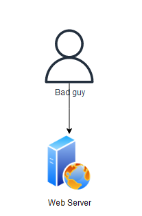
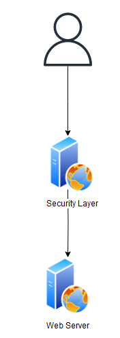
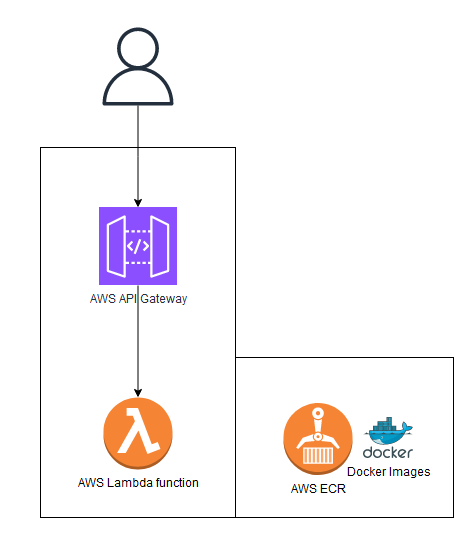

# Security

## Why do we need to secure our API endpoints?

<small>_Now that I've hosted my backend server, got people keep attacking my api la how. put authentication lor._</small>

When building a REST API server, it's important to secure your endpoints to ensure that only authorized users can access and manipulate the data. There are several types of authentication that can be implemented in a REST API. Let's explore a few common ones. Ordered from easiest (less secure) to hardest (most secure).

## 1. Basic Authentication

Basic Authentication is a simple authentication scheme where the client sends the username and password in the `Authorization` header of the HTTP request. The credentials are encoded using Base64 encoding.

### How it works

1. The client includes the `Authorization` header in the HTTP request, with the value `Basic <base64-encoded-credentials>`.
2. The server decodes the credentials and verifies them against the stored user information.
3. If the credentials are valid, the server processes the request; otherwise, it returns an unauthorized response.

### Explain like im 5??

Imagine you want to enter a secret clubhouse. To get in, you need to tell the guard your secret code. If you say the right code, the guard will let you in. If you say the wrong code or don't say any code, the guard won't let you in.

### Example using Express.js

```javascript
const express = require("express");
const app = express();

// Middleware to parse the Authorization header
const basicAuth = (req, res, next) => {
  const authHeader = req.headers.authorization;
  if (authHeader) {
    const credentials = Buffer.from(
      authHeader.split(" ")[1],
      "base64"
    ).toString("ascii");
    const [username, password] = credentials.split(":");
    if (username === "admin" && password === "password") {
      next();
    } else {
      res.status(401).json({ message: "Invalid credentials" });
    }
  } else {
    res.status(401).json({ message: "Missing Authorization header" });
  }
};

// GET /todos endpoint with Basic Authentication
app.get("/todos", basicAuth, (req, res) => {
  // Retrieve and return the list of todos
  const todos = [
    { id: 1, title: "Buy groceries" },
    { id: 2, title: "Clean the house" },
  ];
  res.json(todos);
});
```

## 2. API Key Authentication

API Key Authentication involves providing a unique key to each client that needs to access the API. The client includes this key in the request headers or query parameters.

### How it works

The client includes the API key in the request headers or query parameters.
The server verifies the API key against the stored keys and grants access if it's valid.
If the API key is missing or invalid, the server returns an unauthorized response.

### Explain like im 5

Imagine you have a special key that opens a locked treasure chest. If you have the right key, you can open the chest and see what's inside. If you don't have the key or use the wrong key, you can't open the chest.

### Example using Express.js

```javascript
const express = require("express");
const app = express();

// Middleware to verify the API key
const apiKeyAuth = (req, res, next) => {
  const apiKey = req.query.api_key;
  if (apiKey === "my-secret-key") {
    next();
  } else {
    res.status(401).json({ message: "Invalid API key" });
  }
};

// GET /todos endpoint with API Key Authentication
app.get("/todos", apiKeyAuth, (req, res) => {
  // Retrieve and return the list of todos
  const todos = [
    { id: 1, title: "Buy groceries" },
    { id: 2, title: "Clean the house" },
  ];
  res.json(todos);
});

app.listen(3000, () => {
  console.log("Server is running on port 3000");
});
```

## 3. JWT Authentication

JSON Web Token (JWT) Authentication is a popular authentication mechanism that uses signed tokens to authenticate and authorize requests.

### How it works

The client sends credentials (e.g., username and password) to the server to obtain a JWT.
The server verifies the credentials, generates a JWT containing claims about the user, and signs it with a secret key.
The server sends the JWT back to the client.
The client includes the JWT in the Authorization header of subsequent requests.
The server verifies the JWT signature and extracts the claims to authenticate and authorize the request.

### Explain like im 5

Imagine you have a special badge that proves you are allowed to enter a playground. When you want to enter, you show your badge to the playground guard. The guard checks if your badge is real and if it belongs to you. If everything is okay, the guard lets you play in the playground. You need to show your badge every time you want to enter.

### Example using Express.js

```javascript
const express = require("express");
const jwt = require("jsonwebtoken");
const app = express();

// Middleware to verify the JWT
const jwtAuth = (req, res, next) => {
  const token = req.headers.authorization;
  if (token) {
    jwt.verify(token, "my-secret-key", (err, decoded) => {
      if (err) {
        res.status(401).json({ message: "Invalid token" });
      } else {
        req.userId = decoded.userId;
        next();
      }
    });
  } else {
    res.status(401).json({ message: "Missing token" });
  }
};

// GET /todos endpoint with JWT Authentication
app.get("/todos", jwtAuth, (req, res) => {
  // Retrieve and return the list of todos for the authenticated user
  const todos = [
    { id: 1, title: "Buy groceries", userId: req.userId },
    { id: 2, title: "Clean the house", userId: req.userId },
  ];
  res.json(todos);
});

app.listen(3000, () => {
  console.log("Server is running on port 3000");
});
```

## Conclusion

These are security measures you can do to protect your APIs and data. But regardless of which, your server is still can get hit and be [DDOS-ed](https://www.cloudflare.com/learning/ddos/what-is-a-ddos-attack/). How can we protect the server itself.

### Solution Architecture

What if we can have a security layer that is separate from our application.

This security layer is basically another web server that has the ability to handle authentication.

Attackers have to go through that layer before they hit our application, thus keeping our application safe.

This is an example of what Solution Architecture is, being creative with how you organise your deployed applications on the cloud.

#### Without a security layer



#### With a security layer



#### Security layer using AWS



### Optional Challenge: JWT Bearer Token integration with Auth0

Another lil challenge.

[Auth0](https://auth0.com/) is quite a popular authentication and authorization Platform as a Service (PaaS).
Why build your own authorization server when there's 1 million existing solutions out there.

For this challenge, let's integrate our existing Express.js API server with Auth0 for funsies.

#### Steps at a high level:

1. Create an Auth0 account.
2. Create an Auth0 API and configure it.
3. Write an Express.js middleware that verifies the Access Token passed in the `Authorization` request header.
4. Protect your private API endpoints with this middleware.
5. Test your APIs to see if the JWT Bearer token works. If it does, you're done. ez.

<small>_hint hint: https://auth0.com/docs/quickstart/backend/nodejs/01-authorization_</small>
