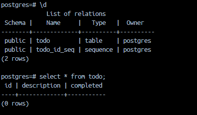

# Database

## Prerequisites

> 1. Docker. I'll not hand hold how to use Docker, so go set it up and figure it out yourselves.
> 2. Some knowledge of SQL to be able to appreciate what an ORM does.

## Code checkpoint

Before getting started with this exercise, ensure that your code looks like [this](https://github.com/seanjin97/geekout-2024/tree/master/backend/advanced/refactoring).

## Why use a Database?

Eh abit useless la api but restart server cannot rmb anything alr. Let's now make our Todo app's data persistent.

When building a REST API server, choosing the right database is crucial to efficiently store and retrieve data. There are two main types of databases: relational and non-relational (NoSQL).

## Relational Databases

Relational databases organize data into tables with predefined schemas, where each table consists of rows (records) and columns (fields). Tables are related to each other using primary and foreign keys. Examples of relational databases include:

- PostgreSQL (i luv)
- MySQL
- Oracle Database
- Microsoft SQL Server

## Non-Relational (NoSQL) Databases

Non-relational databases, also known as NoSQL databases, provide a flexible schema and scale horizontally. They are designed to handle large amounts of unstructured or semi-structured data. Examples of non-relational databases include:

- MongoDB
- Cassandra
- Redis (more for caching)
- Couchbase
- Firebase Realtime Database

## Comparison between Relational and Non-Relational Databases

### Similarities

- Both store and retrieve data
- Both support CRUD (Create, Read, Update, Delete) operations
- Both can be used for various applications

### Differences

| Relational Databases                                                                      | Non-Relational Databases                 |
| ----------------------------------------------------------------------------------------- | ---------------------------------------- |
| Fixed schema                                                                              | Flexible schema                          |
| Structured data                                                                           | Unstructured or semi-structured data     |
| SQL query language                                                                        | NoSQL query languages                    |
| Vertical scaling                                                                          | Horizontal scaling                       |
| [ACID](https://www.mongodb.com/resources/basics/databases/acid-transactions) transactions | Eventual consistency                     |
| Strong consistency                                                                        | Weak consistency                         |
| Suitable for complex queries                                                              | Suitable for large-scale, simple queries |

## Object-Relational Mapping (ORM)

When integrating an Express.js server with a relational database, you often need to map the JSON data received from the client to the corresponding schema in the database. This process is known as Object-Relational Mapping (ORM).

## Integrating Express.js with a Relational Database (using TypeORM)

Okay, let's just use a relational database for this example. Relational databases are used pretty much everywhere and it's probably preferred in most cases. You really can't go wrong going with a relational database.

We wanna skill up ourselves to get hired easily, so let's focus on relational databases.

Let's use the [TypeORM library](https://typeorm.io/) as the ORM for our app. Why?
<small>_idk, i just feel like it. it's p robust and popular. The syntax for TypeORM feels quite similar to the way Spring Boot does it. i luv spring boot so let's leave it as that. there's like 1 million other ORMs you can use so feel free to use any of them instead. but for this example, i'll stick to TypeORM._</small>

TypeORM supports various relational databases and provides a convenient way to define entities and interact with the database.

Let's start by reading the docs @ https://typeorm.io/ and specifically https://typeorm.io/usage-with-javascript

### ok need to install dependencies

```bash
npm install typeorm pg
```

### Configure datasource

Let's write this into a new file called `database.js` that contains all configuration related to our database.

```javascript
const typeorm = require("typeorm");

const Todo = new typeorm.EntitySchema({
  name: "Todo",
  columns: {
    id: {
      primary: true,
      type: "int",
      generated: true,
    },
    description: {
      type: "varchar",
    },
    completed: {
      type: "boolean",
      default: false,
    },
  },
});

const dataSource = new typeorm.DataSource({
  type: "postgres",
  host: "localhost",
  port: 5432,
  username: "postgres",
  password: "password",
  database: "postgres",
  synchronize: true,
  logging: true,
  entities: [Todo],
});

module.exports = { dataSource };
```

and in `app.js`

```javascript
const { dataSource } = require("./database");

// ...rest of your code

dataSource.initialize().then(() => {
  app.listen(8000, () => {
    console.log("Server is running on port 8000");
  });
});
```

## But wait, where is our database??

### Let's spin it up using Docker.

Why? It's just so much more convenient, and if anything goes wrong, just delete the container and re-initialise another.

We'll need the [postgreSQL image](https://hub.docker.com/_/postgres) to run. In our case, let's use the version tag `16.3-alpine3.20`.

```bash
docker run --name postgres-db -e POSTGRES_PASSWORD=password -d postgres:16.3-alpine3.20
```

### Breaking it down

`docker run`: This command is used to start a new container from a Docker image.

`--name postgres-db`: This option sets the name of the container to "postgres-db". You can choose any name you prefer for your PostgreSQL container.

`-e POSTGRES_PASSWORD=password`: This option sets an environment variable inside the container. In this case, it sets the POSTGRES_PASSWORD environment variable to "password". This environment variable is used by the PostgreSQL image to set the password for the default "postgres" user. You should replace "password" with a strong and secure password of your choice.

`-d`: This option runs the container in detached mode. It means that the container will run in the background, and you can continue using the terminal for other tasks.

`postgres:16.3-alpine3.20`: This specifies the Docker image to be used for creating the container. In this case, it uses the "postgres" image with the tag "16.3-alpine3.20". This particular image is based on Alpine Linux version 3.20 and includes PostgreSQL version 16.3.

### To verify that our database is running:

```bash
docker ps
```

You should see that a container called `postgres-db` is running.

## Running our app with our database

Now let's do a npm run start.

```bash
node app.js
```

And now we observe that a bunch of SQL statements are printed out in the terminal console.

To verify that the `todo` table was auto created for us, we can run these commands.

### We need to first enter the docker container

```bash
docker exec -it postgres-db psql -U postgres
```

Breaking it down:

1. `docker exec`: This is the Docker command used to execute a command within a running Docker container.
2. `-it`: These are two flags used with docker exec:

3. `-i` (interactive) keeps STDIN open, allowing you to interact with the container's command.
4. `-t` (tty) allocates a pseudo-terminal, which enables you to use terminal features like command editing and history.

5. `postgres-db`: This is the name or ID of the running Docker container that you want to execute the command in. In this case, it assumes that you have a container named postgres-db running a PostgreSQL database.
6. `psql`: This is the command that you want to execute within the container. psql is the command-line interface for interacting with PostgreSQL databases.
7. `-U postgres`: This is an option passed to the psql command. The -U flag specifies the username to connect to the PostgreSQL database. In this case, it assumes that you want to connect as the default postgres user.

### Then, now from within the container we check if the table has been created

This command describes the tables in your postgreSQL database.

```bash
\d
```

This command selects all rows from the table `todo`;

```sql
SELECT * FROM todo;
```



If you're able to see the table created successfully, then we're good here.

## Updating our `utils` functions to work with our PostgreSQL database

During the [Refactoring](./refactoring.md) section, we extracted out the code that retrieved, created, updated or deleted data from our `todos.json`.

Let's now update those functions to work with our database instead.

Notice how much our lives have been made easier by keeping our code clean?
We can easily just update those functions that interact with the `todos.json` file to now interact with the database.

### Update `readExistingTodos()`

Before: This function read `todos.json` and then parsed it into a javascript object.

Now: This function should read the table `todo` and parse the data as a javascript object. By reading the TypeORM docs, we figure that we need to use the TypeORM `.find()` method.

Updated code:

`utils.js`

```javascript
const todoRepository = dataSource.getRepository("todo");

async function readExistingTodos() {
  const existingTodos = await todoRepository.find();
  return existingTodos;
}
```

Changes:

1. We made readExistingTodos an `async` function so that we can `await` the asynchronous database action. ([What is this async await thingy???](https://www.freecodecamp.org/news/javascript-async-await/))
2. We initilised the `todoRepository` and then used the `.find()` method to query all data in the `todo` table.
3. TypeORM automatically parses the data retrieved into a native javascript object. We no longer need the `JSON.parse` piece of code.

`app.js`

```javascript
app.get("/todos", async (req, res) => {
  const existingTodos = await readExistingTodos();

  res.status(200).json(existingTodos);
});
```

Changes:

1. We added the `await` to the `readExistingTodos()` function call.

### Update `readExistingTodos()`

Before: This function read the entire `todos.json` and then used the javascript `.find` method to find a todo by it's `id`.

Now: This function should use SQL queries for the database to retrieve the todo with the matching `id`. The query and filtering is now performed by the database instead of our code. By reading the TypeORM docs, we figure that we need to use the `.findOneBy({id: id})` method.

`utils.js`

```javascript
async function getSpecificTodo(id) {
  const theTodoIWant = await todoRepository.findOneBy({ id });
  return theTodoIWant;
}
```

`app.js`

```js
app.get("/todos/:id", async (req, res) => {
  const todoId = Number(req.params.id);

  const theTodoIwant = await getSpecificTodo(todoId);

  // What if I can't find the todo item? I need to handle it with grace
  if (!theTodoIwant) {
    return res.status(400).json({ error: "cannot find the todo bro" });
  }
  return res.status(200).json(theTodoIwant);
});
```

### Update `POST /todos`

With a database, the logic to create a row in the table is now abstracted by TypeORM. We need to overhaul and rewrite this entire API route.

Before: This API route creates a new `todo` task and merges it with hte rest of the `todos`.

Now: This API should simply create a new todo using TypeORM. From the TypeORM docs, we figure that we need to use the `.save(todo)` method.

`utils.js`

```javascript
async function saveTodo(todo) {
  return await todoRepository.save(todo);
}

module.exports = {
  //other exports
  saveTodo,
};
```

Changes:

1. We created a new `saveTodo` function that calls `todoRepository.save`. It automatically generates an `id` and sets `completed` to `false` by default.

`app.js`

```js
app.post("/todos", async (req, res) => {
  // Logic to create a new todo item
  const requestBody = req.body;

  const newTodoItemDescription = requestBody.description;

  // What if there's no description field given?
  if (!newTodoItemDescription) {
    return res.status(400).json({ error: "no description bro" });
  }

  const newTodoItem = {
    description: newTodoItemDescription,
  };

  const createdTodoItem = await saveTodo(newTodoItem);

  res.status(201).json(createdTodoItem);
});
```

Changes:

1. We now call the `saveTodo` function from `utils`.
2. We no longer need to generate the `id` nor set `completed` to `false` since the `id` is auto generated by the database, and the `completed` field is set to `false` by default in the `EntitySchema` in `database.js`.

### Update `PUT /todos`

With a database, the logic to update a row in the table is now abstracted by TypeORM. We need to overhaul and rewrite this entire API route.

Before: This API route contains a lot of unneccesary code now that we're using a database. They are no longer needed.

Now: This API should simply update an existing todo using TypeORM. From the TypeORM docs, we figure that we need to use the `.save(todo)` method, but now the todo would contain the `id` and `completed` field to signal that it's an update instead of a creation of a new todo.

`app.js`

```js
app.put("/todos/:id", async (req, res) => {
  const todoId = Number(req.params.id);
  const requestBody = req.body;

  // What if there's no request body
  if (!requestBody) {
    res.status(400).json({ error: "no request body" });
  }
  const description = requestBody.description;
  const completed = requestBody.completed;

  const checkIfTodoExists = await getSpecificTodo(todoId);

  const todoToUpdate = {
    id: todoId,
    description,
    completed,
  };

  if (!checkIfTodoExists) {
    return res.status(400).json("todo not found");
  }

  const updatedTodoItem = await saveTodo(todoToUpdate);

  return res.status(200).json(updatedTodoItem);
});
```

Changes:

1. We now call the `saveTodo` function from `utils`.
2. We check if the `todo` exists before attempting to update it.

### Update `DELETE /todos`

With a database, the logic to update a row in the table is now abstracted by TypeORM. We need to overhaul and rewrite this entire API route.

Before: This API route contains code to get all the todos, then manually filter out the `todo` that is to be deleted before writing it to the JSON file.

Now: This API should use TypeORM to delete a `todo` item by the given `id`. We figure from the TypeORM docs that we can use the `.delete(id)` method to delete a `todo` by it's `id`.

`utils.js`

```javascript
async function deleteTodo(todoId) {
  return await todoRepository.delete(todoId);
}

module.exports = {
  // rest of the exports,
  deleteTodo,
};
```

Changes:

1. We create a new function called `deleteTodo` that encapsulates the TypeORM delete method call.

`app.js`

```js
app.delete("/todos/:id", async (req, res) => {
  const todoId = Number(req.params.id);

  await deleteTodo(todoId);

  return res.status(204).json();
});
```

Changes:

1. We now call the `deleteTodo` function from `utils`.
2. Notice that we're not performing any checks to see if we are truly deleting an existing `todo`. The `DELETE` API method is [idempotent](https://blog.dreamfactory.com/what-is-idempotency/), meaning that calling it multiple times should produce the same result even when the same operation is repeated many times. If we try to delete an `id` that does not exist, then technically it's already "deleted" from our system innit. But it depends on how you want your application to behave.

## Updating your tests

If you did the [Testing](./testing.md) exercise earlier, you'll now realise that all your existing test cases might fail and you'll now need to add new test cases.

Again, you can use chatgpt to rewrite/ modify your tests or do it manually.

Make sure to mock the database functions. This way we can test our application logic without having an actual database connected during unit tests.

## Conclusion

In this section we learnt how to run a database locally using `Docker`, then updated our application to use the database to retrieve or manipulate data instead of writing to a JSON file.

## Final Code

Full code here: https://github.com/seanjin97/geekout-2024/tree/master/backend/advanced/database

## Optional Challenge: Integrate with a cloud database

anudder lil challenge for ya.

This exercise integrates our express server with a local postgreSQL database. This means that now our application wouldn't work once we've deployed it, unless we create a cloud database and link it to our server.

I want you to use a cloud PostgreSQL database service provider (Render, Supabase, etc) and link our Express.js application to it.

### Steps at a high level

1. Create a PostgreSQL database on your cloud service provider of choice. Can't really go wrong with Supabase honestly but das what I would choose cuz I like their developer experience.
2. Update the database configuration in `database.js` to connect to your cloud PostgreSQL database.
3. Optionally, use environment variables for your database configurations e.g.

```js
const dataSource = new typeorm.DataSource({
  type: "postgres",
  host: process.env.DB_HOST,
  port: process.env.DB_PORT,
  username: process.env.DB_USERNAME,
  password: process.env.DB_PASSWORD,
  database: "postgres",
  synchronize: true,
  logging: true,
  entities: [Todo],
});
```

4. Read in the environment variables from a `.env` file or from the host computer's environment.
