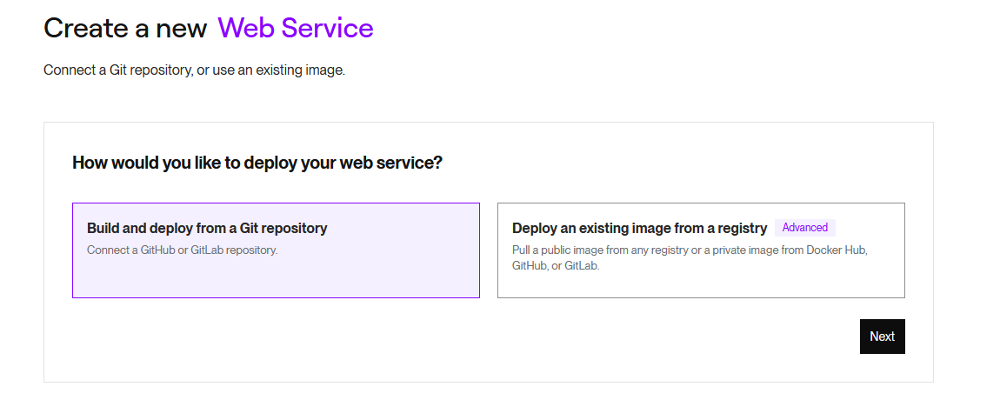
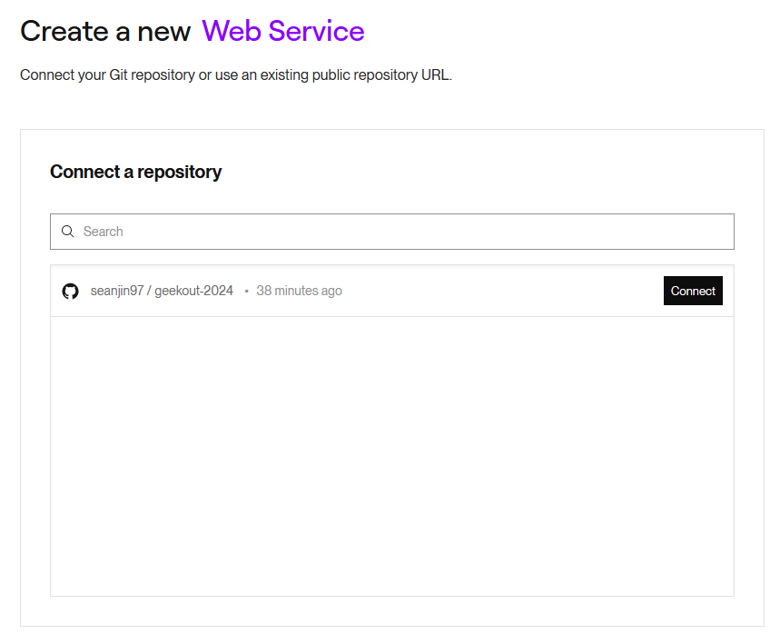
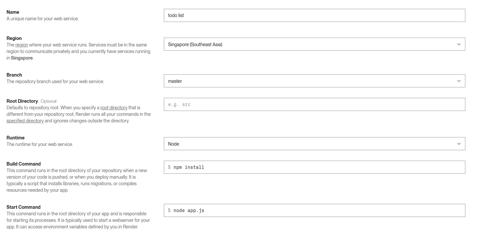
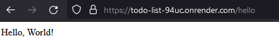

# Hosting

U got ur api alr then now what, ownself call on localhost where got fun. Need to let people use ma, so we host it. Hosting options for backend servers. There's like 1 million of them.

- Some require you to put your card details before using.

- Some setup a free database for you.

- Some allow you to deploy docker images.

- Some are easier to use than others.

**It depends on what you're looking for:**

Easy to use:

1. Render
2. Firebase
3. Railway
4. Fly.io

   ...etc etc

Harder to use, but you get full control:

1. AWS
2. Google Cloud

   ...etc etc

For this exercise I'll just pick [Render](https://render.com/) randomly and it looks pretty easy to use and their [free tier](https://dashboard.render.com/billing#free-usage) looks pretty generous.

## Hosting with Render

1. Create an account with Render or login if you already have an existing account.
2. Create a new Web Service.

3. Create a new GitHub repository (google it if you dk how) and push your Express.js server code there. It should look something like [this](https://github.com/seanjin97/geekout-2024/tree/master/backend/hosting).

4. Connect that GitHub code repository to Render.

5. Fill in the launch details for your application as such.

6. Now wait for your server to be deployed. Once done, try hitting the endpoint that they provisioned for you.

and we now have a live API server. nice.
