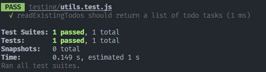

# Testing

## Code checkpoint

Before getting started with this exercise, ensure that your code looks like [this](https://github.com/seanjin97/geekout-2024/tree/master/backend/advanced/refactoring).

## Why Test?

As you saw in the [Refactoring](./refactoring.md) section, after making modifications to your code, you'll always want to verify that it
still works as expected.

How did we test previously? We opened Postman and manually called all our APIs to verify that it still works. That's kinda tedious.

**How can we make our lives easier?** We can write automated tests that do all that for us.

## Types of Testing

The most common 2 that you'll hear about in backend development are:

1. **Unit Testing**: This involves testing individual units or components of the software to ensure they function as expected. It is usually performed by developers during the development phase. They are supposed to be fast.
2. **Integration Testing**: This type of testing involves combining individual units and testing them as a group to verify that they work together correctly. It ensures that different modules or components of the software interact and integrate properly. They're expected to be slower as it would test the database integration with your API server.

## Tips to Writing Tests

don't ever spend more time writing tests than writing actual business logic.

always test the code behaviour. for e.g. `readExistingTodos()` should `read and parse the existing todos from the file`.

## Writing Unit Tests

To start, we'll need to add a unit testing library so that we can do unit tests.

The staple unit testing library for backend is `jest`. It's rlly popular and many backend projects use it for testing. So we too will use it.

Read more about `jest` [here](https://jestjs.io/docs/getting-started).

### Mental Model of Unit Testing

1. Call a function that you want to test
2. Compare the output of that function with a value you decide
3. For e.g. function A should give me "a". The test passes if functionA does indeed give you "a".

#### Let's get started

1. Install `jest`

```bash
npm install --save-dev jest
```

2. Let's test the functions in the `utils.js` file called. Create a file called `utils.test.js`.

3. Let's then import `jest` and the functions we want to test in `utils.test.js`

```javascript
require("jest");
const { readExistingTodos, getSpecificTodo, saveTodos } = require("./utils");
```

### Test `readExistingTodos()`

By reading the `jest` [docs](https://jestjs.io/docs/getting-started), we can figure out to do this to write our first test.

```javascript
test("readExistingTodos should return a list of todo tasks", () => {
  expect(readExistingTodos()).toEqual([
    {
      id: 1,
      description: "buy groceries 😃🍎",
      completed: false,
    },
    {
      id: 2,
      description: "drink water 🥤",
      completed: false,
    },
    {
      id: 3,
      description: "help papa water plants 😛🥦",
      completed: true,
    },
  ]);
});
```

Let's run the tests `npm run test` and we should see this.



### Repeat for the rest of the functions.

You can copy the whole `utils.js` into chatgpt and ask it to generate you the tests to save time.

As a dev, writing the tests are a time sink, but having robust tests is extremely desirable.

<small>_writing tests are a chore, aint nobody got time for allat._</small>

Let's use chatgpt to our advantage to save us time so that we can focus on other important things.

Prompt: `given this utils.js file generate me jest tests for each function.`

Result:

```javascript
const fs = require("fs");
const { readExistingTodos, getSpecificTodo, saveTodos } = require("./utils");

jest.mock("fs");

describe("readExistingTodos", () => {
  it("should read and parse the existing todos from the file", () => {
    const mockTodos = [
      { id: 1, text: "Todo 1" },
      { id: 2, text: "Todo 2" },
    ];
    fs.readFileSync.mockReturnValue(JSON.stringify(mockTodos));

    const todos = readExistingTodos();

    expect(fs.readFileSync).toHaveBeenCalledWith("./todos.json", "utf-8");
    expect(todos).toEqual(mockTodos);
  });
});

describe("getSpecificTodo", () => {
  it("should return the todo with the specified id", () => {
    const mockTodos = [
      { id: 1, text: "Todo 1" },
      { id: 2, text: "Todo 2" },
      { id: 3, text: "Todo 3" },
    ];
    fs.readFileSync.mockReturnValue(JSON.stringify(mockTodos));

    const todo = getSpecificTodo(2);

    expect(fs.readFileSync).toHaveBeenCalledWith("./todos.json", "utf-8");
    expect(todo).toEqual({ id: 2, text: "Todo 2" });
  });

  it("should return undefined if the todo with the specified id is not found", () => {
    const mockTodos = [
      { id: 1, text: "Todo 1" },
      { id: 2, text: "Todo 2" },
    ];
    fs.readFileSync.mockReturnValue(JSON.stringify(mockTodos));

    const todo = getSpecificTodo(3);

    expect(fs.readFileSync).toHaveBeenCalledWith("./todos.json", "utf-8");
    expect(todo).toBeUndefined();
  });
});

describe("saveTodos", () => {
  it("should save the todos to the file", () => {
    const mockTodos = [
      { id: 1, text: "Todo 1" },
      { id: 2, text: "Todo 2" },
    ];

    saveTodos(mockTodos);

    expect(fs.writeFileSync).toHaveBeenCalledWith(
      "todos.json",
      JSON.stringify(mockTodos)
    );
  });
});
```

We use `jest.mock("fs")` to mock the `fs` module, allowing us to control its behavior in the tests. [why mock?](https://www.codium.ai/blog/mock-testing/)

nice, now we have unit tests. refactoring our code will be much easier in the future. Why? if we mistakenly change something, the test would break, making sure we either update the tests if the change in behaviour is intended, or fix the code if the behaviour change was not intended.

## Final Code

After adding tests, you should end up with something like [this](https://github.com/seanjin97/geekout-2024/tree/master/backend/advanced/testing).

## Optional Challenge: Integration Testing

lil challenge for ya.

We have unit tests now, but we don't have integration tests.

### Steps at a high level:

1. Determine which integration testing library to use
2. Write the test cases to call all your APIs and verify if you get the expected responses. We don't need to do integration testing for all edge cases, just the [happy flow](https://userpilot.com/blog/happy-path/) would do.
