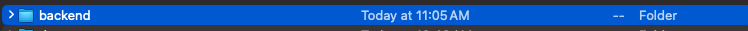
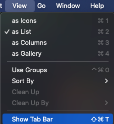
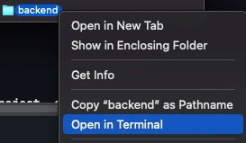

# Node.js Project Setup

In this section, we'll guide you through the process of setting up a new Node.js project from scratch and installing the necessary dependencies, including Express.

## Opening a folder with VSCode

1. Create a new folder for the project. Could be anywhere like `C:\Users\<YourName>\Documents\new-project` for windows or `/Users/<YourName>/Documents/new-project` for mac.

### For macOS:
1. Create and open the folder.
   
   

2. Show tabs.
   
   
   
3. Open the folder in terminal.
   
   
   
4. In the terminal, open VSCode by running the following command.
   
   ```bash
   code .
   ```
   

### For Windows
1. Create and open the folder.
2. Right click anywhere in the window and click `"Open with Code"`

## Initialise a node project
1.Run the following command to initialize a new Node.js project:

   ```bash
   npm init
   ```

1. You will be prompted to enter various details about your project, such as the project name, version, description, and entry point. You can spam press Enter to accept the default values or provide your own.
2. Once you have completed the prompts, a `package.json` file will be created in your project directory. This file contains information about your project and its dependencies.

## Conclusion

Here's a summary of what you learned:

- How to initialize a new Node.js project using `npm init`.

Next, we'll install project dependencies to run your application.
