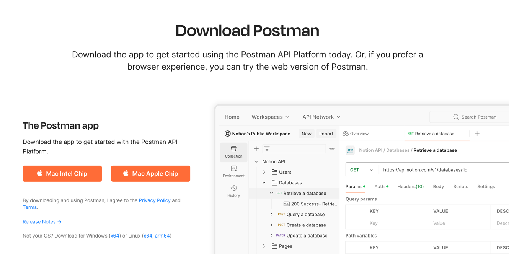
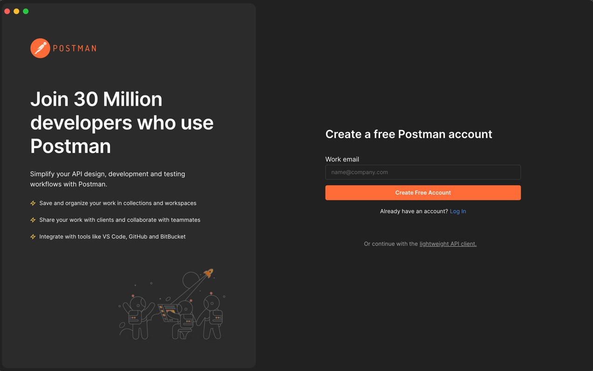
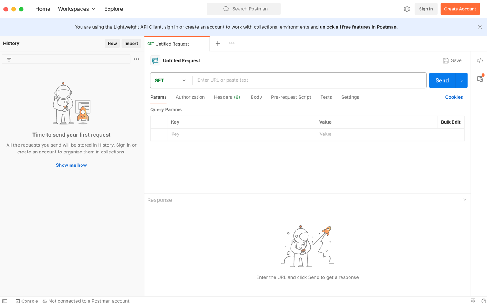

# Postman

Postman is a popular API client (more on what an API is and what an API client does during the workshop) that makes it easy to create, share, test, and document APIs. This guide will walk you through the steps to install and set up Postman on macOS and Windows.

## Prerequisites

Before you start, ensure you have permission to install applications on your machine.

## Installation Instructions

### For macOS

1. **Download Postman**: Visit the [Postman website](https://www.postman.com/downloads/) and download the latest version for macOS.

   

2. **Install the Application**:
    - Open the downloaded file (`Postman-mac.zip`).
    - Drag the Postman app to your `Applications` folder.

3. **Launch Postman**:
    - Open your `Applications` folder and click on Postman.
    - If prompted, confirm that you trust the application.

### For Windows

1. **Download Postman**: Go to the [Postman website](https://www.postman.com/downloads/) and download the latest version for Windows.

   

2. **Install the Application**:
    - Open the downloaded file (`Postman-win64-latest-Setup.exe`).
    - Follow the installation wizard to complete the setup.

3. **Launch Postman**:
    - Find Postman in your Start menu and click on it.
    - If prompted, confirm that you trust the application.

## First Steps After Installation

After you've installed Postman, you can start creating and testing your APIs:

1. **Click "continue with the lightweight API client"** 
2. **You should see this screen next, and you're done!** 

## Conclusion

You’re now ready to explore the extensive features of Postman to enhance your API development and testing workflow. For more detailed usage tutorials, check the [official Postman Learning Center](https://learning.postman.com/).
