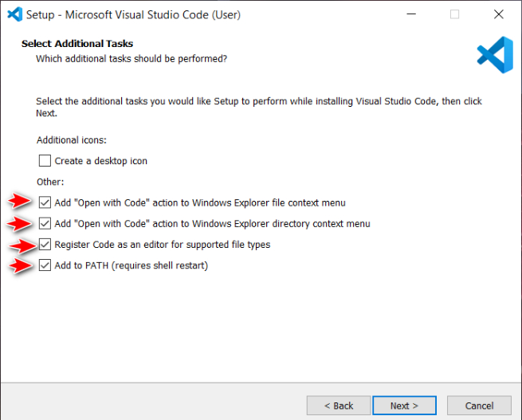

# Visual Studio Code

Visual Studio Code (VS Code) is a popular and powerful code editor that provides a great development experience for various programming languages. In this guide, we'll walk you through the steps to install VS Code on macOS and Windows.

## Installing VS Code on macOS

1. Visit the official Visual Studio Code website: [https://code.visualstudio.com](https://code.visualstudio.com)
2. Click on the "Download for Mac" button.
3. Once the download is complete, open the ZIP file.
4. Drag the Visual Studio Code application to your Applications folder.
5. Open VS Code from the Applications folder or use Spotlight search to launch it.

## Installing VS Code on Windows

1. Visit the official Visual Studio Code website: [https://code.visualstudio.com](https://code.visualstudio.com)
2. Click on the "Download for Windows" button.
3. Once the download is complete, run the installer.
4. Follow the installation wizard, accepting the default options or customizing as desired.
5. I personally tick everything
   
   
6. After the installation is finished, VS Code will launch automatically.

